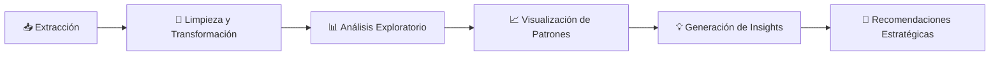

---

# 📊 Análisis de Evasión de Clientes - TelecomX LATAM

<div align="center">


_Un análisis de datos de extremo a extremo para identificar los factores clave de la evasión de clientes y proponer estrategias de retención basadas en evidencia._

[**🚀 Ver el Análisis**](#-ejecución-directa-en-colab) **|** [**📈 Principales Hallazgos**](#-principales-hallazgos) **|** [**💡 Recomendaciones**](#-recomendaciones-estratégicas) **|** [**🛠️ Metodología**](#️-metodología)

</div>

---

## 🎯 Descripción del Proyecto

Este proyecto de ciencia de datos explora los factores determinantes en la **evasión (churn)** de clientes para **TelecomX LATAM**, un caso de estudio de una empresa de telecomunicaciones. A través de un pipeline completo de análisis de datos, desde la extracción hasta la visualización, identificamos los patrones críticos que explican por qué los clientes se van y proponemos acciones estratégicas para mejorar la retención.

### 🌟 Características Destacadas

-   ✅ **Extracción Automatizada:** Carga de datos directamente desde una fuente remota (JSON) con manejo de errores.
-   ✅ **Pipeline de Limpieza Completo:** Proceso robusto de limpieza, estandarización y transformación de datos.
-   ✅ **Análisis Exploratorio Visual (EDA):** Más de 15 visualizaciones detalladas para descubrir insights.
-   ✅ **Ingeniería de Características:** Creación de nuevas variables como `daily_charges` y `total_services_count` para un análisis más profundo.
-   ✅ **Recomendaciones Estratégicas:** Acciones concretas y justificadas, basadas en los hallazgos del análisis.
-   ✅ **Código Reproducible:** Notebook documentado y organizado para una fácil ejecución y comprensión.

---

## 🚀 Inicio Rápido

### Prerrequisitos

-   Python 3.8+
-   Jupyter Notebook o Google Colab
-   Conexión a internet (para descargar el dataset)

### Instalación

1.  **Clona el repositorio:**
    ```bash
    git clone https://github.com/frenrey3/Desafio-TelecomX-Churn-Analysis.git
    cd Desafio-TelecomX-Churn-Analysis
    ```

2.  **Instala las dependencias:**
    ```bash
    pip install -r requirements.txt
    ```

3.  **Ejecuta el análisis:**
    Abre y ejecuta el notebook principal ubicado en la raíz del proyecto.
    ```bash
    jupyter notebook "Desafío TelecomX LATAM.ipynb"
    ```

### 🔗 Ejecución Directa en Colab

No necesitas instalar nada. ¡Ejecuta el análisis completo directamente en tu navegador!

[](https://colab.research.google.com/github/frenrey3/Desafio-TelecomX-Churn-Analysis/blob/main/Desaf%C3%ADo%20TelecomX%20LATAM.ipynb)

---

## 📊 Dataset

| Característica | Detalle                                                                                      |
| :------------- | :------------------------------------------------------------------------------------------- |
| **Fuente**     | `https://storage.googleapis.com/desafio-telecomx-churn-analysis/Dataset/TelecomX_Data.json` |
| **Registros**  | 7,043 clientes (después de la limpieza)                                                        |
| **Variables**  | 21 características originales + 1 creada (`daily_charges`)                                    |
| **Formato**    | JSON → DataFrame de Pandas                                                                     |

#### Variables Clave Analizadas
-   **Demográficas**: `gender`, `seniorcitizen`, `partner`, `dependents`.
-   **Servicios Contratados**: `phoneservice`, `internetservice`, `onlinesecurity`, `techsupport`, etc.
-   **Condiciones Comerciales**: `contract`, `paymentmethod`, `paperlessbilling`, `charges_monthly`, `charges_total`.
-   **Variable Objetivo**: `churn` (Sí/No).

---

## 📈 Principales Hallazgos

Se identificó una **tasa de evasión general del 26.5%**. Los siguientes factores son los predictores más fuertes de churn:

1.  **💡 Tipo de Contrato (`contract`):** Es el factor más influyente. Los clientes con contrato **mes a mes** tienen una tasa de churn del **42.7%**, mientras que los de contratos de dos años solo tienen un **2.8%**.
2.  **💳 Método de Pago (`paymentmethod`):** El pago con **cheque electrónico (`electronic_check`)** está asociado con una tasa de evasión alarmante del **45.3%**, casi triplicando la de otros métodos de pago automáticos.
3.  **🌐 Servicio de Internet (`internetservice`):** Los clientes con **fibra óptica (`fiber_optic`)** tienen una tasa de churn del **41.9%**, sugiriendo posibles problemas de calidad, precio o expectativas no cumplidas en este servicio premium.
4.  **🛡️ Servicios de Valor Añadido:** La ausencia de servicios de seguridad como `onlinesecurity` o `techsupport` incrementa drásticamente la probabilidad de evasión. Por ejemplo, los clientes sin `onlinesecurity` tienen una tasa de churn del **31.3%** vs. el **14.6%** de los que sí lo tienen.

---

## 🛠️ Metodología

El proyecto sigue un flujo de trabajo estructurado de ciencia de datos para garantizar resultados robustos y reproducibles.



1.  **Extracción de Datos:** Carga automática del dataset JSON desde una URL pública, con validación de la respuesta.
2.  **Limpieza y Transformación:** Tratamiento de valores nulos, corrección de tipos de datos, estandarización de texto (minúsculas, eliminación de espacios) y normalización de nombres de columnas.
3.  **Análisis Exploratorio (EDA):** Cálculo de estadísticas descriptivas y análisis de distribución para cada variable.
4.  **Visualización de Patrones:** Creación de gráficos comparativos (barras, histogramas, boxplots) para visualizar la relación entre cada característica y la variable `churn`.
5.  **Generación de Insights y Recomendaciones:** Interpretación de los hallazgos para formular conclusiones de negocio y proponer acciones estratégicas.

---

## 🎨 Visualizaciones Destacadas

<div align="center">

**Tasa de Evasión por Tipo de Contrato**
_Muestra el enorme impacto de los contratos a largo plazo en la retención._


---

**Tasa de Evasión por Cantidad de Servicios**
_Revela una relación no lineal: el punto de mayor riesgo está en tener 2-4 servicios._


</div>

---

## 💡 Recomendaciones Estratégicas

Basado en los hallazgos, se proponen las siguientes acciones para reducir la tasa de evasión:

1.  **Fomentar Contratos a Largo Plazo:** Implementar campañas agresivas para migrar a los clientes de contratos `month-to-month` a planes anuales, ofreciendo descuentos significativos por permanencia.
2.  **Optimizar Métodos de Pago:** Investigar las fricciones asociadas al `electronic_check` y lanzar incentivos para que los clientes se cambien a métodos de pago automáticos, que tienen tasas de churn mucho menores.
3.  **Auditar la Experiencia de Fibra Óptica:** Realizar un análisis de causa raíz para entender por qué los clientes de `fiber_optic` se van. Evaluar la estructura de precios, la calidad del servicio y la efectividad del soporte técnico.
4.  **Promocionar Servicios de Valor Añadido:** Crear "mini-bundles" que incluyan servicios clave de retención como `onlinesecurity` y `techsupport` a precios atractivos, y educar a los clientes sobre sus beneficios.

---

## 🧪 Tecnologías Utilizadas

<div align="center">


</div>

| Categoría         | Herramientas                               |
| :---------------- | :----------------------------------------- |
| **Entorno**       | Google Colab, Jupyter Notebook, Vertex AI  |
| **Datos**         | `pandas`, `numpy`, `requests`, `json`        |
| **Visualización** | `matplotlib`, `seaborn`                      |

---

## 📁 Estructura del Proyecto

```
.
├── Desafío TelecomX LATAM.ipynb    # Notebook principal con el análisis completo
├── README.md                       # Este archivo
└── requirements.txt                # Dependencias del proyecto
```

---

## 🤝 Contribuciones

Las contribuciones son siempre bienvenidas. Si tienes ideas para mejorar el análisis o añadir nuevas características, por favor sigue estos pasos:

1.  🍴 Haz un Fork del proyecto.
2.  🌿 Crea una nueva rama para tu característica (`git checkout -b feature/mejora-increible`).
3.  💾 Haz Commit de tus cambios (`git commit -m 'Agregar una mejora increíble'`).
4.  📤 Haz Push a la rama (`git push origin feature/mejora-increible`).
5.  📋 Abre un Pull Request.

---

## 👨‍💻 Autor

<div align="center">

**Nelson Enrique Reyes Fabián**

*Data Scientist & AI Developer*

[](https://www.linkedin.com/in/nelson-enrique-reyes-fabi%C3%A1n-80572a138/)
[](https://github.com/frenrey3)
[](mailto:frenrey3@gmail.com)

</div>

---

## 📄 Licencia

Este proyecto está bajo la Licencia MIT. Consulta el archivo `LICENSE` para más detalles.

---

<div align="center">
    <b>⭐ Si este proyecto te fue útil, ¡no olvides darle una estrella! ⭐</b>
    <br>
    <i>Desarrollado con ❤️ para la comunidad de Data Science.</i>
</div>
