# 📊 Análisis de Evasión de Clientes - TelecomX LATAM

<div align="center">


*Análisis integral de evasión de clientes utilizando técnicas avanzadas de ciencia de datos*

[🚀 Inicio Rápido](#-inicio-rápido) • [📈 Resultados](#-principales-hallazgos) • [🛠️ Metodología](#️-metodología) • [📚 Documentación](#-documentación)

</div>

---

## 🎯 Descripción del Proyecto

Este proyecto de ciencia de datos explora los factores determinantes en la **evasión (churn)** de clientes de **TelecomX LATAM**, una empresa de telecomunicaciones ficticia. A través de un análisis exhaustivo de datos, identificamos patrones críticos que permiten predecir y prevenir la pérdida de clientes.

### 🌟 Características Destacadas

- ✅ **Extracción automática** de datos desde fuente remota (JSON)
- ✅ **Pipeline completo** de limpieza y transformación
- ✅ **Análisis exploratorio visual** con 15+ visualizaciones
- ✅ **Métricas estadísticas** avanzadas y correlaciones
- ✅ **Recomendaciones estratégicas** basadas en datos
- ✅ **Código reproducible** y documentado

---

## 🚀 Inicio Rápido

### Prerrequisitos

```bash
Python 3.8+
Jupyter Notebook o Google Colab
Conexión a internet (para descarga de datos)
```

### Instalación

1. **Clona el repositorio**
   ```bash
   git clone https://github.com/nelsonenriquereyes/TelecomX-Churn-EDA.git
   cd TelecomX-Churn-EDA
   ```

2. **Instala las dependencias**
   ```bash
   pip install -r requirements.txt
   ```

3. **Ejecuta el análisis**
   ```bash
   jupyter notebook notebooks/Informe_TelecomX_Evasion.ipynb
   ```

### 🔗 Ejecución Directa en Colab

[](https://colab.research.google.com/github/nelsonenriquereyes/TelecomX-Churn-EDA/blob/main/notebooks/Informe_TelecomX_Evasion.ipynb)

---

## 📊 Dataset

| Característica | Detalle |
|---|---|
| **Fuente** | `https://storage.googleapis.com/enrique-data-bucket/TelecomX_Data.json` |
| **Registros** | 7,043 clientes |
| **Variables** | 21 características |
| **Formato** | JSON → DataFrame |
| **Período** | Datos transversales |

### Variables Principales
- **Demográficas**: `gender`, `senior_citizen`, `partner`, `dependents`
- **Servicios**: `phone_service`, `internet_service`, `online_security`, etc.
- **Comerciales**: `contract`, `payment_method`, `monthly_charges`, `total_charges`
- **Target**: `churn` (Sí/No)

---

## 📈 Principales Hallazgos

### 🎯 Métricas Clave

| Métrica | Valor | Impacto |
|---------|-------|---------|
| **Tasa de Churn General** | 26.5% | 🔴 Alto |
| **Churn Mes-a-Mes** | 42.7% | 🔴 Crítico |
| **Retención 2+ años** | 84.3% | 🟢 Excelente |
| **Churn Electronic Check** | 45.3% | 🔴 Alto riesgo |

### 📊 Insights Críticos

1. **💡 Contrato**: Los clientes con contrato mensual tienen **3.5x más probabilidad** de cancelar
2. **⏰ Antigüedad**: Clientes con <6 meses tienen **75% más riesgo** de churn
3. **💳 Pago**: El método "electronic check" está asociado con **45.3% de churn**
4. **🛡️ Servicios**: La ausencia de servicios premium incrementa el riesgo en **35%**

---

## 🛠️ Metodología

### Proceso de Análisis

```mermaid
graph LR
    A[Extracción] --> B[Limpieza]
    B --> C[EDA]
    C --> D[Visualización]
    D --> E[Insights]
    E --> F[Recomendaciones]
```



1. **📥 Extracción de Datos**
   - Descarga automática desde URL
   - Validación de integridad
   - Conversión JSON → DataFrame

2. **🧹 Limpieza y Transformación**
   - Tratamiento de valores nulos
   - Conversión de tipos de datos
   - Encoding de variables categóricas

3. **🔍 Análisis Exploratorio**
   - Estadísticas descriptivas
   - Análisis univariado y bivariado
   - Detección de outliers

4. **📈 Visualización**
   - Distribuciones y correlaciones
   - Análisis por segmentos
   - Gráficos interactivos

---

## 📁 Estructura del Proyecto

```
TelecomX-Churn-EDA/
├── 📓 notebooks/
│   └── Informe_TelecomX_Evasion.ipynb    # Análisis principal
├── 📄 markdown/
│   └── Informe_TelecomX.md               # Reporte en Markdown
├── 🖼️ images/
│   ├── churn_distribution.png
│   ├── contract_churn.png
│   ├── correlation_matrix.png
│   └── churn_by_services.png
├── 📊 data/
│   └── TelecomX_Data.json                # Dataset original
├── 📋 requirements.txt                   # Dependencias
├── 📖 README.md                          # Este archivo
└── 📜 LICENSE                           # Licencia MIT
```

---

## 🎨 Visualizaciones Destacadas

<div align="center">

### Distribución de Churn por Tipo de Contrato


### Matriz de Correlación


</div>

---

## 💡 Recomendaciones Estratégicas

### 🎯 Acciones Inmediatas

1. **Programa de Retención Early Warning**
   - Identificar clientes <6 meses
   - Ofertas personalizadas para contratos anuales

2. **Optimización de Métodos de Pago**
   - Incentivos para cambiar de "electronic check"
   - Promociones para auto-débito

3. **Estrategia de Servicios Premium**
   - Bundles atractivos con servicios de valor agregado
   - Onboarding mejorado para nuevos clientes

### 📊 Impacto Proyectado

| Acción | Reducción Churn Estimada | ROI Esperado |
|--------|-------------------------|--------------|
| Programa Retención | -15% | 300% |
| Cambio Método Pago | -8% | 150% |
| Servicios Premium | -12% | 250% |

---

## 🧪 Tecnologías Utilizadas

<div align="center">


</div>

### Stack Técnico Detallado

| Categoría | Herramientas |
|-----------|-------------|
| **Entorno** | Vertex AI Notebooks (GCP), Jupyter |
| **Datos** | `pandas`, `numpy`, `requests`, `json` |
| **Visualización** | `matplotlib`, `seaborn`, `plotly` |
| **Estadística** | `scipy`, `statsmodels` |

---

## 📚 Documentación

### 📖 Recursos Adicionales

- [📓 Notebook Completo](notebooks/Informe_TelecomX_Evasion.ipynb)
- [📄 Reporte Markdown](markdown/Informe_TelecomX.md)
- [🎨 Galería de Visualizaciones](images/)

### 🔗 Enlaces Útiles

- [Dataset Original](https://storage.googleapis.com/enrique-data-bucket/TelecomX_Data.json)
- [Desafío Alura LATAM](https://www.alura.com.br/challenges)

---

## 🤝 Contribuciones

¡Las contribuciones son bienvenidas! Si tienes ideas para mejorar el análisis:

1. 🍴 Fork el proyecto
2. 🌿 Crea una rama (`git checkout -b feature/mejora-increible`)
3. 💾 Commit tus cambios (`git commit -m 'Agregar mejora increíble'`)
4. 📤 Push a la rama (`git push origin feature/mejora-increible`)
5. 📋 Abre un Pull Request

---

## 👨‍💻 Autor

<div align="center">

**Nelson Enrique Reyes Fabián**

*Data Scientist & AI Developer*

[](https://linkedin.com/in/nelsonenriquereyes)
[](https://github.com/nelsonenriquereyes)
[](mailto:nelson.reyes@email.com)

</div>

---

## 📄 Licencia

Este proyecto está bajo la Licencia MIT - ver el archivo [LICENSE](LICENSE) para más detalles.

---

## 🙏 Agradecimientos

- **Alura LATAM** por el desafío y los datos
- **Google Cloud Platform** por el entorno de desarrollo
- **Comunidad Open Source** por las herramientas utilizadas

---

<div align="center">

**⭐ Si este proyecto te fue útil, no olvides darle una estrella ⭐**

*Desarrollado con ❤️ para la comunidad de Data Science*

</div>